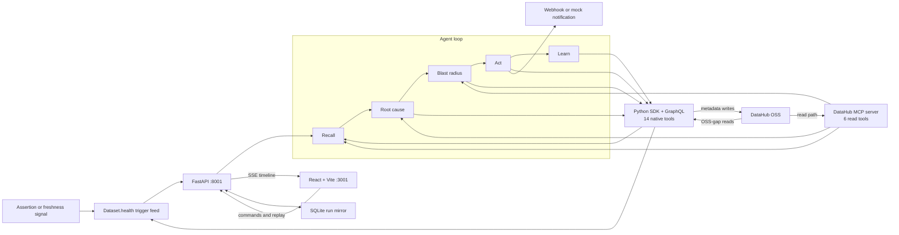

# On-Call Data Engineer Agent

**A DataHub-native agent that finds the root cause of a data incident, measures its blast radius,
acts on it, and writes the post-mortem back as memory for the next incident.**

Built for **Build with DataHub: The Agent Hackathon**, in the **Agents That Do Real Work** track.

A human on-call engineer who gets paged at 2 a.m. can spend hours opening datasets one by one,
walking lineage upstream, comparing freshness and row counts, finding downstream consumers, and
tracking down owners. The hard part is not producing a plausible explanation; it is gathering
enough catalog evidence to identify the first intrinsically broken node, act without crossing the
wrong boundary, and preserve that evidence so the same investigation is never paid for twice.

## Architecture



Catalog reads use the pinned `uvx mcp-server-datahub@0.6.0` server and its six exposed tools.
Writes and OSS gaps use fourteen always-available native tools backed by the DataHub Python SDK
and GraphQL; a conditional native-lineage tool is enabled if MCP is unavailable. This split is
intentional: on OSS, MCP's `get_dataset_assertions` is Cloud-only, so it cannot provide the
trigger. The app derives that feed from `Dataset.health`, then uses native reads for assertion
status, freshness, usage, incidents, and the structured-property recall index.

## The closed loop

1. **Trigger.** Poll DataHub health and normalize a failing assertion or freshness breach into a
   triage signal.
2. **Recall.** Search `oncall.postmortem` on the symptom and its ancestors before walking lineage;
   treat any match as a hypothesis that still needs live verification.
3. **Root cause.** Walk column-level lineage upstream one hop at a time, checking assertions,
   freshness, row-count history, schema, queries, and ownership. Stop only at an unhealthy node
   with no unhealthy parent.
4. **Blast radius.** Walk downstream through datasets, charts, dashboards, and models, then rank
   the affected assets by catalog usage.
5. **Act.** Raise or reuse an incident, tag the root-cause dataset and implicated column, tag the
   impacted assets, notify the resolved owners, and leave the incident in investigation for a
   human to remediate.
6. **Learn.** Write a structured and narrative post-mortem back to DataHub and mirror the run in
   SQLite for fast replay in the UI.

## What the agent writes back to DataHub

| Artifact                                | DataHub surface                                                      | How it is written                                                                                             | Why it matters                                                                                                                |
| --------------------------------------- | -------------------------------------------------------------------- | ------------------------------------------------------------------------------------------------------------- | ----------------------------------------------------------------------------------------------------------------------------- |
| Incident                                | Incident on the symptom dataset                                      | GraphQL `raiseIncident`, followed by `updateIncidentStatus` to leave confirmed evidence in `INVESTIGATION`    | Gives operators a native, deduplicated case with severity, status, and causal evidence.                                       |
| Dataset + **column-level** tags         | Entity tags and editable schema-field tags                           | Python SDK `add_tag` on assets and `dataset[field].add_tag` on the implicated column                          | Makes both the affected estate and the exact broken field visible in DataHub.                                                 |
| Institutional-memory link               | Root-cause dataset's institutional memory                            | Python SDK `add_link` to the app's post-mortem detail page                                                    | Puts the human-readable investigation one click from the source asset.                                                        |
| Structured property `oncall.postmortem` | Multi-valued rich-text structured property on the root-cause dataset | Python SDK `set_structured_property`, appending compact JSON                                                  | **This is the searchable recall index.** The next run searches it with an `EXISTS` filter and ranks matching prior incidents. |
| Document entity                         | Published `documentInfo` related to root cause and symptom           | SDK emitter writes `DocumentInfo` and `DocumentSettings` aspects                                              | Preserves the full Markdown narrative as a first-class catalog artifact even though OSS document search is unavailable.       |
| Merged custom properties                | Root-cause dataset custom properties                                 | `DatasetPatchBuilder` merges `oncall.last_incident_id`, `oncall.last_root_cause`, and `oncall.incident_count` | Maintains a compact summary without replacing unrelated properties such as `seeded_by`.                                       |

Owner notification is an external action rather than a DataHub metadata artifact. If
`SLACK_WEBHOOK_URL` is absent, the exact webhook payload is recorded under `examples/notifications/`.

## The memory loop, measured

**What is being compared.** Two triage runs against the **same root cause** (`raw.trips_raw`
stalled behind its 6-hour freshness SLA) but **different symptoms**, so the second run cannot
simply repeat the first. The cold run was triggered by a row-count assertion failure on
`marts.agg_daily_rides`; the repeat run was triggered on `marts.agg_zone_demand`, a dataset the
agent had never triaged, whose root cause sits **three lineage hops upstream**. Between the two,
`demo/reset.py --keep-memory` restored the warehouse to health while deliberately preserving the
post-mortem — so the only difference is what the agent remembered.

| Run             |                                  Recall | Time to root cause | Tool calls |
| --------------- | --------------------------------------: | -----------------: | ---------: |
| Cold incident   |                         No prior memory |             65.5 s |         71 |
| Repeat incident | Prior post-mortem recalled and verified |               38 s |         50 |

`GET /api/compare` reports **41% less time to root cause and 30% fewer tool calls**. Both runs
reached the same correct root cause, and the repeat run still verified it against live evidence
rather than trusting memory alone. The checked-in
[comparison snapshot](examples/snapshots/compare.json) contains the complete source records; the
[cold and recall post-mortems](examples/README.md) are the exact artifacts those runs generated.

These are two runs on one seeded warehouse, not a benchmark — reproduce them yourself with the
demo walkthrough below.

## One-command setup

Prerequisites:

- Docker with a DataHub quickstart already running
- `uv` and `uvx`
- bun or npm
- an OpenAI API key

```bash
cp .env.example .env
# Set OPENAI_API_KEY in .env, then:
./scripts/dev.sh
```

The script checks Docker and GMS, syncs dependencies, starts the API on
`http://localhost:8001`, seeds and verifies the demo if `/api/demo/state` is unseeded, then starts
the UI on `http://localhost:3001`. Ctrl-C stops the app processes it started; it never stops the
shared DataHub containers.

This repository's local quickstart exposes GMS on `http://localhost:8081`. **That port is a local
default, not a universal DataHub port.** Set `DATAHUB_GMS_URL` in [.env](.env.example) for another
deployment. The local DataHub UI defaults to `http://localhost:9002` and is independently
configurable with `DATAHUB_UI_URL`.

## Demo walkthrough

1. Run `./scripts/dev.sh`; for an explicit idempotent reseed and verification, run
   `./scripts/seed.sh`.
2. Open the Command Deck, arm `stale_upstream`, wait for the signal inbox, and triage
   `agg_daily_rides`. Watch recall report a cold start and the upstream causal path converge on
   `raw.trips_raw`.
3. Open the blast-radius and action tabs. The triage tags **14 impacted assets** and notifies
   **6 owners**. Follow the links into DataHub to inspect the incident, dataset and column tags,
   structured property, Document, institutional-memory link, and merged custom properties.
4. Heal the demo without deleting memory: `./scripts/reset.sh --keep-memory`.
5. Arm `recall_hit`, triage `agg_zone_demand`, and watch the prior root cause get recalled from an
   ancestor and verified directly.
6. Open Compare or run `curl -s http://localhost:8001/api/compare | jq .` to see the measured
   cold-versus-recall delta.

Arm `schema_drift` after a full reset to exercise a different failure path whose root cause is
`raw.drivers_raw`; this is the credibility check that the agent is not hardcoded to one answer.

## Seeded RideFlow warehouse

| Surface                      | Seeded contents | Role in the demo                                                           |
| ---------------------------- | --------------: | -------------------------------------------------------------------------- |
| Raw datasets                 |               4 | Ingestion sources, including the stale trips feed and schema-drift source. |
| Staging datasets             |               4 | First transformations where inherited failures become visible.             |
| Mart and ML-feature datasets |               7 | Facts, dimensions, aggregates, and model features.                         |
| Charts                       |               4 | BI consumers with seeded audience size.                                    |
| Dashboards                   |               3 | Business-facing consumers used in impact ranking.                          |
| ML models                    |               1 | A non-BI downstream consumer.                                              |
| Assertions                   |               9 | Seeded definitions plus OSS-supported run events.                          |
| Query entities               |               5 | Real SQL evidence attached to catalog subjects.                            |

The primary lineage graph contains **15 datasets, 4 charts, 3 dashboards, and 1 ML model: 23
entities connected by 24 lineage edges**. Dataset-to-dataset edges carry explicit column mappings,
including renamed and derived fields; assertions and Query entities are catalog evidence outside
that primary graph count.

## Screens

Screenshot slots live under `docs/screens/*.png`. They are intentionally placeholders until the
demo capture; no screenshot is represented as generated in this repository.

- `docs/screens/command-deck.png` — healthy catalog, scenario controls, and signal inbox.
- `docs/screens/live-triage.png` — streamed reasoning timeline beside the causal lineage path.
- `docs/screens/blast-radius.png` — usage-ranked downstream assets and resolved owners.
- `docs/screens/memory-compare.png` — recalled post-mortem and cold-versus-recall metrics.

## Known limitations: OSS vs Cloud

- Native assertion creation and evaluation are DataHub Cloud features. On OSS, the demo seeds
  assertion definitions and emits assertion run events, which is the supported path on the tested
  server.
- MCP `get_dataset_assertions` is Cloud-only. The agent uses native GraphQL reads for assertion
  details and `Dataset.health` for the alert feed.
- Incident Slack notifications and semantic search are Cloud-only. `raiseIncident` itself works
  on the tested OSS server; notification delivery uses an optional webhook or a checked-in mock
  receipt. Documents are read by URN, while recall searches the structured property instead.
- OSS has no chart or dashboard usage aspect that this project can populate, so audience size is
  a seeded `weekly_views` custom property. Dataset usage comes from usage-statistics aspects.
- The `hasFailingAssertions` search filter is broken on GMS `v1.5.0.6` and always returns an empty
  result in this environment. The trigger feed is therefore derived from `Dataset.health`.
- The demo runs one uvicorn worker and uses SQLite for its local event/run mirror. It is a local
  reproducible system, not a horizontally scaled or multi-tenant service.
- Triggering is polling-based; DataHub Actions integration is not included.

## Notes for DataHub developers

Building this surfaced five behaviours on **DataHub OSS GMS v1.5.0.6** that cost real debugging
time. Each was reproduced live against a stock `datahub docker quickstart`, and each is worked
around in this codebase. We are writing them up here in case they are useful upstream.

1. **`operations(limit: n)` truncates before ordering, and is not newest-first.** On a dataset whose
   `operation` series had ~10 points, `limit: 5` omitted the newest record entirely — so a dataset
   26 hours stale read as 1.2 hours *fresh*. The failure is silent and intermittent; nothing in the
   response indicates truncation. Workaround: request a generous `limit` and take
   `max(..., key=timestampMillis)` client-side. See `backend/src/oncall_agent/datahub/reads.py`.
2. **`hasFailingAssertions` as a search filter never populates.** `searchAcrossEntities` with
   `hasFailingAssertions = true` returned `total: 0` at t+10/20/30/45 s after a `FAILURE`
   `assertionRunEvent`, while the same dataset's `health` field correctly reported
   `{type: "ASSERTIONS", status: "FAIL", causes: [...]}`. We derive the trigger feed from `health`.
3. **Two writes to the same (entity, timeseries aspect) in one run can coalesce non-deterministically.**
   The REST sink batches asynchronously; emitting a healthy point and then a broken point for the
   same dataset in quick succession sometimes left the *healthy* one winning. Separating
   `timestampMillis` is not sufficient — we restructured so each series is written exactly once.
4. **`add_lineage(column_lineage=True | "auto_fuzzy" | "auto_strict")` silently writes nothing when
   the two schemas share no column names.** No exception, no warning; the downstream simply ends up
   with no `upstreamLineage` aspect and every later lineage read returns `[]`. This reads exactly
   like "lineage is broken". Related: `transformation_text=` imports `sqlglot`, and without it the
   whole `add_lineage` call raises so the edge is never written.
5. **Asymmetric GraphQL fields fail the entire query.** `FineGrainedLineage.confidenceScore` is
   accepted by the Python write model but does not exist on the read schema; requesting it fails the
   whole query rather than that field. Same class: `CustomAssertionInfo.entity`,
   `SchemaFieldRef.fieldPath`, `institutionalMemory.elements[].actor`.

Timing observed for anyone building similar tooling: lineage becomes queryable ~5 s after write,
but **assertion run events took ~50 s to index**, so state-change verification needs a ~2 minute
budget rather than a few seconds.

## Project layout

```text
backend/                         FastAPI, agent loop, DataHub adapters, demo seed, tests
frontend/                        React UI, SSE replay, lineage and memory views
scripts/                         One-command development, seed, and reset wrappers
examples/                        Real API snapshots and generated run artifacts
skill/datahub-incident-triage/   Reusable DataHub incident-triage skill
docs/screens/                    Reserved demo screenshot paths
```

## Tests

```bash
cd backend
UV_CACHE_DIR=/private/tmp/uv-cache env -u VIRTUAL_ENV uv sync
UV_CACHE_DIR=/private/tmp/uv-cache env -u VIRTUAL_ENV uv run pytest
UV_CACHE_DIR=/private/tmp/uv-cache env -u VIRTUAL_ENV uv run ruff check .

cd ../frontend
bun install --frozen-lockfile
bun run build
```

Use `npm install && npm run build` when bun is unavailable. Live DataHub tests are opt-in and are
excluded by the backend's default pytest configuration.

## Contributing and license

See [CONTRIBUTING.md](CONTRIBUTING.md) for safety and verification rules. The project is licensed
under the [Apache License 2.0](LICENSE). The reusable skill and its installation notes are in
[skill/README.md](skill/README.md).
