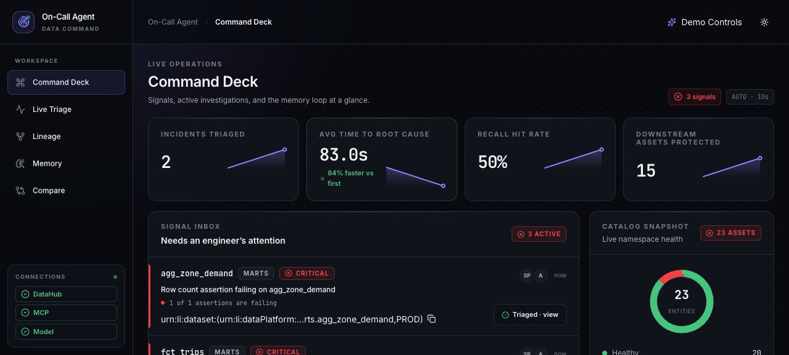
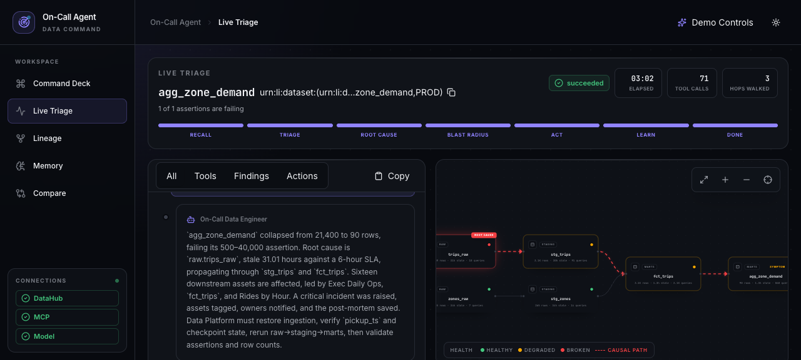
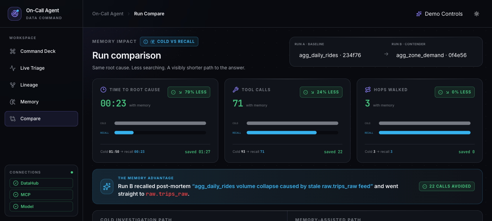
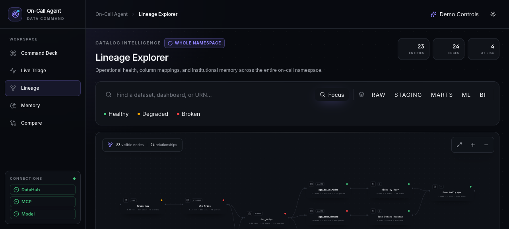

# On-Call Data Engineer Agent

**A DataHub-native agent that finds the root cause of a data incident, measures its blast radius,
acts on it, and writes the post-mortem back as memory for the next incident.**

Built for **Build with DataHub: The Agent Hackathon**, in the **Agents That Do Real Work** track.

A human on-call engineer who gets paged at 2 a.m. can spend hours opening datasets one by one,
walking lineage upstream, comparing freshness and row counts, finding downstream consumers, and
tracking down owners. The hard part is not producing a plausible explanation; it is gathering
enough catalog evidence to identify the first intrinsically broken node, act without crossing the
wrong boundary, and preserve that evidence so the same investigation is never paid for twice.

## Demo video

**2 minutes 54 seconds — the real app against a live DataHub quickstart, with side panels
quoting the filmed runs' recorded evidence.**

> **Watch: <https://youtu.be/8VTZzn7bgtE>** — 2:54, captioned. The upload package (title,
> description, chapters, thumbnail) is in [`dist-video/UPLOAD.md`](dist-video/UPLOAD.md).

| | |
| --- | --- |
| 0:00 | What a data catalog is, and what DataHub maps |
| 0:18 | How the agent reaches DataHub: six MCP tools and seventeen of its own |
| 0:39 | The control panel: 23 healthy assets, empty signal inbox |
| 0:51 | A stopped ingestion job, and the assertions that start failing |
| 1:06 | One click hands over the page |
| 1:18 | Memory first — a cold start, then the walk up the lineage |
| 1:36 | The four checks it runs at every table |
| 1:47 | The root cause: trips_raw, 26 hours stale, and the stop rule that confirms it |
| 2:03 | Blast radius ranked by usage, and the write-backs landing in DataHub |
| 2:22 | A second incident three hops away — the agent recalls its own post-mortem |
| 2:38 | Cold versus memory-assisted, side by side |

The narration quotes the filmed pair's measured deltas — 24% fewer tool calls, 14% less time —
and every figure on screen is quoted verbatim from that pair's recorded runs. See
[the memory loop, measured](#the-memory-loop-measured) for what is being compared and how much
those figures move between runs.

## Architecture


Catalog reads use the pinned `uvx mcp-server-datahub@0.6.0` server and its six exposed tools.
Writes and OSS gaps use seventeen native tools backed by the DataHub Python SDK and GraphQL —
sixteen always available, plus a native-lineage fallback that is enabled only when MCP is
unavailable. This split is
intentional: on OSS, MCP's `get_dataset_assertions` is Cloud-only, so it cannot provide the
trigger. The app derives that feed from `Dataset.health`, then uses native reads for assertion
status, freshness, usage, incidents, and the structured-property recall index.

## The closed loop

1. **Trigger.** Poll DataHub health and normalize a failing assertion or freshness breach into a
   triage signal.
2. **Recall.** Search `oncall.postmortem` on the symptom and its ancestors before walking lineage;
   treat any match as a hypothesis that still needs live verification.
3. **Root cause.** Walk column-level lineage upstream one hop at a time, checking assertions,
   freshness, row-count history, schema, queries, and ownership. Stop only at an unhealthy node
   with no unhealthy parent.
4. **Blast radius.** Walk downstream through datasets, charts, dashboards, and models, then rank
   the affected assets by catalog usage.
5. **Act.** Raise or reuse an incident, tag the root-cause dataset and implicated column, tag the
   impacted assets, notify the resolved owners, and leave the incident in investigation for a
   human to remediate.
6. **Learn.** Write a structured and narrative post-mortem back to DataHub and mirror the run in
   SQLite for fast replay in the UI.

## What the agent writes back to DataHub

| Artifact                                | DataHub surface                                                      | How it is written                                                                                             | Why it matters                                                                                                                |
| --------------------------------------- | -------------------------------------------------------------------- | ------------------------------------------------------------------------------------------------------------- | ----------------------------------------------------------------------------------------------------------------------------- |
| Incident                                | Incident on the symptom dataset                                      | GraphQL `raiseIncident`, followed by `updateIncidentStatus` to leave confirmed evidence in `INVESTIGATION`    | Gives operators a native, deduplicated case with severity, status, and causal evidence.                                       |
| Dataset + **column-level** tags         | Entity tags and editable schema-field tags                           | Python SDK `add_tag` on assets and `dataset[field].add_tag` on the implicated column                          | Makes both the affected estate and the exact broken field visible in DataHub.                                                 |
| Institutional-memory link               | Root-cause dataset's institutional memory                            | Python SDK `add_link` to the app's post-mortem detail page                                                    | Puts the human-readable investigation one click from the source asset.                                                        |
| Structured property `oncall.postmortem` | Multi-valued rich-text structured property on the root-cause dataset | Python SDK `set_structured_property`, appending compact JSON                                                  | **This is the searchable recall index.** The next run searches it with an `EXISTS` filter and ranks matching prior incidents. |
| Document entity                         | Published `documentInfo` related to root cause and symptom           | SDK emitter writes `DocumentInfo` and `DocumentSettings` aspects                                              | Preserves the full Markdown narrative as a first-class catalog artifact even though OSS document search is unavailable.       |
| Merged custom properties                | Root-cause dataset custom properties                                 | `DatasetPatchBuilder` merges `oncall.last_incident_id`, `oncall.last_root_cause`, and `oncall.incident_count` | Maintains a compact summary without replacing unrelated properties such as `seeded_by`.                                       |

Owner notification is an external action rather than a DataHub metadata artifact. If
`SLACK_WEBHOOK_URL` is absent, the agent still renders the exact webhook payload and writes it to
`data/notifications/` (gitignored runtime output). Two curated receipts from the runs measured
below are committed under `examples/notifications/`.

## The memory loop, measured

**What is being compared.** Two triage runs against the **same root cause** (`raw.trips_raw`
stalled behind its 6-hour freshness SLA) but **different symptoms**, so the second run cannot
simply repeat the first. The cold run was triggered by a row-count assertion failure on
`marts.agg_daily_rides`; the repeat run was triggered on `marts.agg_zone_demand`, a dataset the
agent had never triaged, whose root cause sits **three lineage hops upstream**. Between the two,
`demo/reset.py --keep-memory` restored the warehouse to health while deliberately preserving the
post-mortem — so the only difference is what the agent remembered.

| Run                                    |                                  Recall | Time to root cause | Tool calls |
| -------------------------------------- | --------------------------------------: | -----------------: | ---------: |
| Cold — symptom on `agg_daily_rides`     |                         No prior memory |             87.5 s |         93 |
| Repeat — symptom on `agg_zone_demand`   | Prior post-mortem recalled and verified |             33.2 s |         72 |

`GET /api/compare` reports **62% less time to root cause and 23% fewer tool calls** for this pair.

The **demo video** was filmed from a different pair of the same experiment — cold
`run_9a5cb891af954977` (92 tool calls, 83.0 s to root cause) against recall
`run_71b45939d95844ab` (70 calls, 71.5 s): the **24% fewer tool calls and 14% less time, over
the same three hops**, that the narration quotes. The verbatim `/api/compare` response for the
filmed pair is committed at
[`examples/snapshots/compare-video-pair.json`](examples/snapshots/compare-video-pair.json). Two
pairs, two deltas — that spread is the run-to-run variance discussed below.

The saving is structural, not a shortcut. Cold, the agent must walk every upstream branch capable
of producing the signal and prove each one healthy — it examined and cleared the `stg_zones` /
`raw.zones_raw` branch before concluding. With a recalled hypothesis it goes straight to
`raw.trips_raw`, runs the full health check there, and — once that node verifies as an intrinsic
breach with no unhealthy parent — only has to establish the causal path back to the symptom. A
confirmed hypothesis that explains the signal licenses not searching the alternatives. If the
recalled node fails verification, the agent says so, discards the memory and falls back to the
full walk.

Both figures include the mandatory live schema check at every examined node and the
index-independent source-node corroboration before the stop rule, so they are not comparable to
figures from earlier revisions of this README. The checked-in
[comparison snapshot](examples/snapshots/compare.json) is the verbatim `/api/compare` response for
this exact pair, and the [cold and recall post-mortems](examples/README.md) plus both full event
logs under `examples/runs/` are the artifacts these two runs generated.

**Run-to-run variance is real.** The agent is not deterministic; across repeated cold runs we
observed 58-144 s to root cause for the same scenario. The committed
[snapshot](examples/snapshots/compare.json) is one specific pair, and the tool-call counts are far
more stable than the wall-clock times. What reproduces is the direction and rough magnitude of the
memory effect, not these exact figures.

**Time to root cause is not the whole run.** The full triage — blast-radius ranking, the DataHub
write-backs, authoring the post-mortem, resolving the incident — takes longer than reaching the root cause. Expect roughly two to five minutes of wall clock end to end.

**On "15" versus "16" downstream entities.** The agent's own prose sometimes says sixteen. Both
numbers are real and they count different things: DataHub's lineage facets return **16** downstream
entities from `raw.trips_raw`, one of which is an `MLFeature`. The ranked blast radius contains
**15** — 7 datasets, 4 charts, 3 dashboards and 1 ML model — because we only rank entity types we
can attach a defensible usage score and owner to. Fifteen is the number to trust; it is what gets
tagged and what the Blast Radius tab shows.

These are two runs on one seeded warehouse, not a benchmark — reproduce them yourself with the
demo walkthrough below.

## One-command setup

Prerequisites:

- Docker with a DataHub quickstart already running
- `uv` and `uvx`
- bun or npm
- an OpenAI API key

```bash
cp .env.example .env
# Set OPENAI_API_KEY in .env, then:
./scripts/dev.sh
```

The script checks Docker and GMS, syncs dependencies, starts the API on
`http://localhost:8001`, seeds and verifies the demo if `/api/demo/state` is unseeded, then starts
the UI on `http://localhost:3001`. Ctrl-C stops the app processes it started; it never stops the
shared DataHub containers.

**Start both servers through `dev.sh` rather than by hand.** Each has an IPv4/IPv6 trap that the
script already handles, and they point in opposite directions. Vite started without `--host` binds
`[::1]` only, so the UI answers on `localhost:3001` but not on `127.0.0.1:3001`. The API binds IPv4
only, so a health check aimed at `localhost:8001` can resolve to `::1` and be answered by an
unrelated process that happens to hold it — a 404 on `/api/health` is a wrong-host symptom, not a
wrong route. Check the API on `127.0.0.1`.

This repository's local quickstart exposes GMS on `http://localhost:8081`. **That port is a local
default, not a universal DataHub port.** Set `DATAHUB_GMS_URL` in [.env](.env.example) for another
deployment. The local DataHub UI defaults to `http://localhost:9002` and is independently
configurable with `DATAHUB_UI_URL`.

## Demo walkthrough

1. Run `./scripts/dev.sh`; for an explicit idempotent reseed and verification, run
   `./scripts/seed.sh`.
2. Open the Command Deck, arm `stale_upstream`, wait for the signal inbox, and triage
   `agg_daily_rides`. Watch recall report a cold start and the upstream causal path converge on
   `raw.trips_raw`.
3. Open the blast-radius and action tabs. The triage tags **15 impacted assets** and notifies
   **6 owners**. Follow the links into DataHub to inspect the incident, dataset and column tags,
   structured property, Document, institutional-memory link, and merged custom properties.
4. Heal the demo without deleting memory: `./scripts/reset.sh --keep-memory`.
5. Arm `recall_hit`, triage `agg_zone_demand`, and watch the prior root cause get recalled from an
   ancestor and verified directly.
6. Open Compare or run `curl -s http://localhost:8001/api/compare | jq .` to see the measured
   cold-versus-recall delta.

Arm `schema_drift` after a full reset to exercise a different failure path whose root cause is
`raw.drivers_raw`; this is the credibility check that the agent is not hardcoded to one answer.

## Seeded RideFlow warehouse

| Surface                      | Seeded contents | Role in the demo                                                           |
| ---------------------------- | --------------: | -------------------------------------------------------------------------- |
| Raw datasets                 |               4 | Ingestion sources, including the stale trips feed and schema-drift source. |
| Staging datasets             |               4 | First transformations where inherited failures become visible.             |
| Mart and ML-feature datasets |               7 | Facts, dimensions, aggregates, and model features.                         |
| Charts                       |               4 | BI consumers with seeded audience size.                                    |
| Dashboards                   |               3 | Business-facing consumers used in impact ranking.                          |
| ML models                    |               1 | A non-BI downstream consumer.                                              |
| Assertions                   |               9 | Seeded definitions plus OSS-supported run events.                          |
| Query entities               |               5 | Real SQL evidence attached to catalog subjects.                            |

The primary lineage graph contains **15 datasets, 4 charts, 3 dashboards, and 1 ML model: 23
entities connected by 24 lineage edges**. Dataset-to-dataset edges carry explicit column mappings,
including renamed and derived fields; assertions and Query entities are catalog evidence outside
that primary graph count.

## Screens

Real captures of the running app at 1440x900, taken from the two runs described above.

| | |
| --- | --- |
|  | **Command Deck** — signal inbox, memory-loop metrics, catalog health. |
|  | **Live Triage** — streamed reasoning beside the causal path, with the root cause and symptom marked on the lineage canvas. |
|  | **Compare** — the cold run against the memory-assisted run on the same root cause. |
|  | **Lineage Explorer** — whole-namespace topology with the health overlay. |

## Known limitations: OSS vs Cloud

- Native assertion creation and evaluation are DataHub Cloud features. On OSS, the demo seeds
  assertion definitions and emits assertion run events, which is the supported path on the tested
  server.
- MCP `get_dataset_assertions` is Cloud-only. The agent uses native GraphQL reads for assertion
  details and `Dataset.health` for the alert feed.
- Incident Slack notifications and semantic search are Cloud-only. `raiseIncident` itself works
  on the tested OSS server; notification delivery uses an optional webhook or a checked-in mock
  receipt. Documents are read by URN, while recall searches the structured property instead.
- OSS has no chart or dashboard usage aspect that this project can populate, so audience size is
  a seeded `weekly_views` custom property. Dataset usage comes from usage-statistics aspects.
- The `hasFailingAssertions` search filter is broken on GMS `v1.5.0.6` and always returns an empty
  result in this environment. The trigger feed is therefore derived from `Dataset.health`.
- The demo runs one uvicorn worker and uses SQLite for its local event/run mirror. It is a local
  reproducible system, not a horizontally scaled or multi-tenant service.
- Triggering is polling-based; DataHub Actions integration is not included.

## Notes for DataHub developers

Building this surfaced five behaviours on **DataHub OSS GMS v1.5.0.6** that cost real debugging
time. Each was reproduced live against a stock `datahub docker quickstart`, and each is worked
around in this codebase. We are writing them up here in case they are useful upstream.

1. **`operations(limit: n)` truncates before ordering, and is not newest-first.** On a dataset whose
   `operation` series had ~10 points, `limit: 5` omitted the newest record entirely — so a dataset
   26 hours stale read as 1.2 hours *fresh*. The failure is silent and intermittent; nothing in the
   response indicates truncation. Workaround: request a generous `limit` and take
   `max(..., key=timestampMillis)` client-side. See `backend/src/oncall_agent/datahub/reads.py`.
2. **`hasFailingAssertions` as a search filter never populates.** `searchAcrossEntities` with
   `hasFailingAssertions = true` returned `total: 0` at t+10/20/30/45 s after a `FAILURE`
   `assertionRunEvent`, while the same dataset's `health` field correctly reported
   `{type: "ASSERTIONS", status: "FAIL", causes: [...]}`. We derive the trigger feed from `health`.
3. **Two writes to the same (entity, timeseries aspect) in one run can coalesce non-deterministically.**
   The REST sink batches asynchronously; emitting a healthy point and then a broken point for the
   same dataset in quick succession sometimes left the *healthy* one winning. Separating
   `timestampMillis` is not sufficient — we restructured so each series is written exactly once.
4. **`add_lineage(column_lineage=True | "auto_fuzzy" | "auto_strict")` silently writes nothing when
   the two schemas share no column names.** No exception, no warning; the downstream simply ends up
   with no `upstreamLineage` aspect and every later lineage read returns `[]`. This reads exactly
   like "lineage is broken". Related: `transformation_text=` imports `sqlglot`, and without it the
   whole `add_lineage` call raises so the edge is never written.
5. **Asymmetric GraphQL fields fail the entire query.** `FineGrainedLineage.confidenceScore` is
   accepted by the Python write model but does not exist on the read schema; requesting it fails the
   whole query rather than that field. Same class: `CustomAssertionInfo.entity`,
   `SchemaFieldRef.fieldPath`.

   **Correction.** An earlier version of this list also named
   `institutionalMemory.elements[].actor` as a missing field. That was our misdiagnosis, and it is
   wrong: the field exists, is `NON_NULL`, and its type is `ResolvedActor` — a **union** of
   `CorpUser | CorpGroup`. Selecting it bare fails with
   `Validation error (SubselectionRequired@[...])`, not "field undefined". The correct form is an
   inline fragment, which we verified returns cleanly:

   ```graphql
   institutionalMemory { elements { url actor { ... on CorpUser { urn } ... on CorpGroup { urn } } } }
   ```

   We are leaving the correction visible rather than quietly deleting the claim, since the rest of
   this list asks to be taken on trust.

Timing observed for anyone building similar tooling: lineage becomes queryable ~5 s after write,
but **assertion run events took ~50 s to index**, so state-change verification needs a ~2 minute
budget rather than a few seconds.

## Project layout

```text
backend/                         FastAPI, agent loop, DataHub adapters, demo seed, tests
frontend/                        React UI, SSE replay, lineage and memory views
scripts/                         One-command development, seed, and reset wrappers
examples/                        Real API snapshots and generated run artifacts
skill/datahub-incident-triage/   Reusable DataHub incident-triage skill
docs/screens/                    Real UI captures used in this README
```

## Tests

```bash
cd backend
UV_CACHE_DIR=/private/tmp/uv-cache env -u VIRTUAL_ENV uv sync
UV_CACHE_DIR=/private/tmp/uv-cache env -u VIRTUAL_ENV uv run pytest
UV_CACHE_DIR=/private/tmp/uv-cache env -u VIRTUAL_ENV uv run ruff check .

cd ../frontend
bun install --frozen-lockfile
bun run build
```

Use `npm install && npm run build` when bun is unavailable. Live DataHub tests are opt-in and are
excluded by the backend's default pytest configuration.

## Contributing and license

See [CONTRIBUTING.md](CONTRIBUTING.md) for safety and verification rules. The project is licensed
under the [Apache License 2.0](LICENSE). The reusable skill and its installation notes are in
[skill/README.md](skill/README.md).
